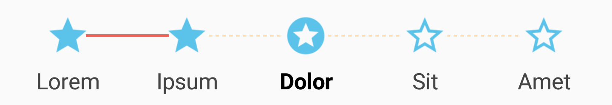
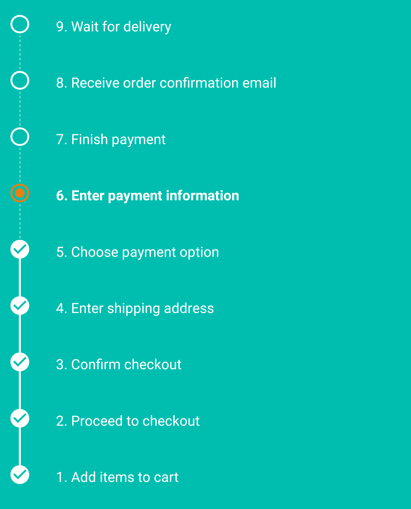
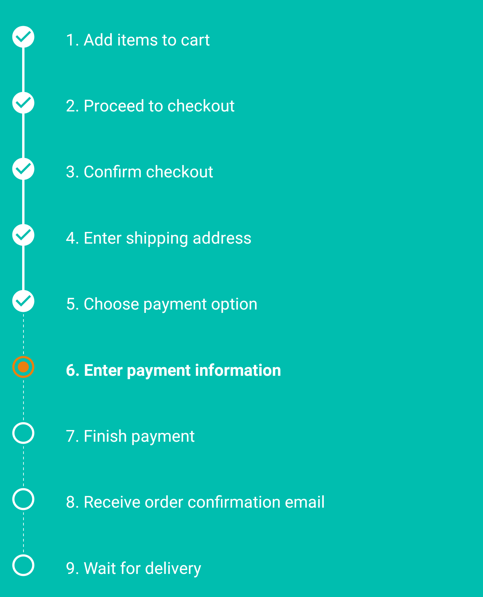

# StepView [](https://jitpack.io/#vinaygopinath/StepView)
A custom View for a step-by-step process (order checkout, app first launch, intro, timeline visualization). The StepView
displays the name of the step and an icon associated with the state of the step (completed, currently active, not completed).

## Demo
StepView Demo app is available on [Google Play Store](https://play.google.com/store/apps/details?id=com.vinay.stepview.demo). APKs are also available under [releases](https://github.com/vinaygopinath/StepView/releases).

## Screenshots

### HorizontalStepView

Default

</img>

Customized

</img>

### VerticalStepView
Default (reverse order)



Default (forward order)



## Getting started

### Add plugin

1. Add `jitpack.io` to your root build.gradle file.
	```
	repositories {
	  ..
	  maven { 
	    url "https://jitpack.io"
	  }
	}
	```

2. Add StepView as a dependency in your module build.gradle
	```
	dependencies {
	  implementation 'com.github.vinaygopinath:StepView:2.0.1'
	}
	```

### Use StepView in XML

```xml
<com.vinay.stepview.HorizontalStepView
    android:id="@+id/horizontal_step_view"
    android:layout_width="match_parent"
    android:layout_height="wrap_content"/>
	
<!-- OR -->

<com.vinay.stepview.VerticalStepView
    android:id="@+id/vertical_step_view"
    android:layout_width="match_parent"
    android:layout_height="wrap_content"/>

```

### Provide the steps

```java
HorizontalStepView horizontalStepView = findViewById(R.id.horizontal_step_view);

List<Step> stepList = new ArrayList<>();
stepList.add(new Step("Lorem", Step.State.COMPLETED));
stepList.add(new Step("Ipsum", Step.State.COMPLETED));
stepList.add(new Step("Dolor", Step.State.CURRENT));
stepList.add(new Step("Sit")); // State defaults to NOT_COMPLETED
stepList.add(new Step("Amet")); // State defaults to NOT_COMPLETED

horizontalStepView.setSteps(stepList);
```

## Customization
```java
horizontalStepView // Also applies to VerticalStepView
	// Drawables
	.setCompletedStepIcon(AppCompatResources.getDrawable(getContext(), R.drawable.ic_custom_completed))
	.setNotCompletedStepIcon(AppCompatResources.getDrawable(getContext(), R.drawable.ic_custom_not_completed))
	.setCurrentStepIcon(AppCompatResources.getDrawable(getContext(), R.drawable.ic_custom_current))
	// Text colors
	.setCompletedStepTextColor(Color.DKGRAY) // Default: Color.WHITE
	.setNotCompletedStepTextColor(Color.DKGRAY) // Default: Color.WHITE
	.setCurrentStepTextColor(Color.BLACK) // Default: Color.WHITE
	// Line colors
	.setCompletedLineColor(Color.parseColor("#ea655c")) // Default: Color.WHITE
	.setNotCompletedLineColor(Color.parseColor("#eaac5c")) // Default: Color.WHITE
	// Text size (in sp)
	.setTextSize(15) // Default: 14sp
	// Drawable radius (in dp)
	.setCircleRadius(15) // Default: ~11.2dp
	// Length of lines separating steps (in dp)
	.setLineLength(50); // Default: ~34dp

verticalStepView
	.setReverse(false); // Default: true
```

## State change
```java
List<Step> stepList = new ArrayList<>();
stepList.add(new Step("Lorem", Step.State.CURRENT));
stepList.add(new Step("Ipsum"));
stepList.add(new Step("Dolor"));

// Set steps
mHorizontalStepView.setSteps(stepList);

// Complete the first step and set the second step as currently active
mHorizontalStepView.setStepState(Step.State.COMPLETED, 0);
mHorizontalStepView.setStepState(Step.State.CURRENT, 1);

// OR update the List and call setSteps again
stepList.get(0).setState(Step.State.COMPLETED);
stepList.get(1).setState(Step.State.CURRENT);
mHorizontalStepView.setSteps(stepList);

// OR provide a new step to replace the step at a position
Step updatedStep = new Step("Updated Step Text", Step.State.CURRENT);
mHorizontalStepView.setStep(updatedStep, 0);

```

## Credits
This repo is a fork of [baoyachi](https://github.com/baoyachi)'s [StepView](https://github.com/baoyachi/StepView), which is based on [anton46](https://github.com/anton46/)'s [Android-StepsView](https://github.com/anton46/Android-StepsView)